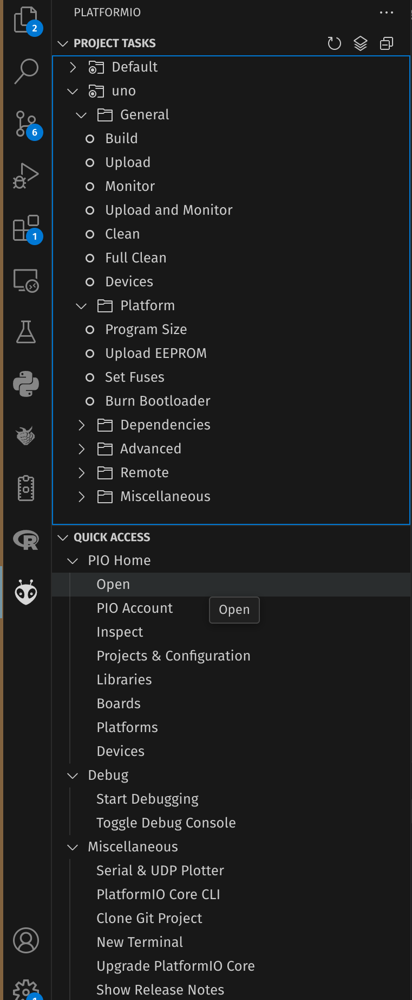
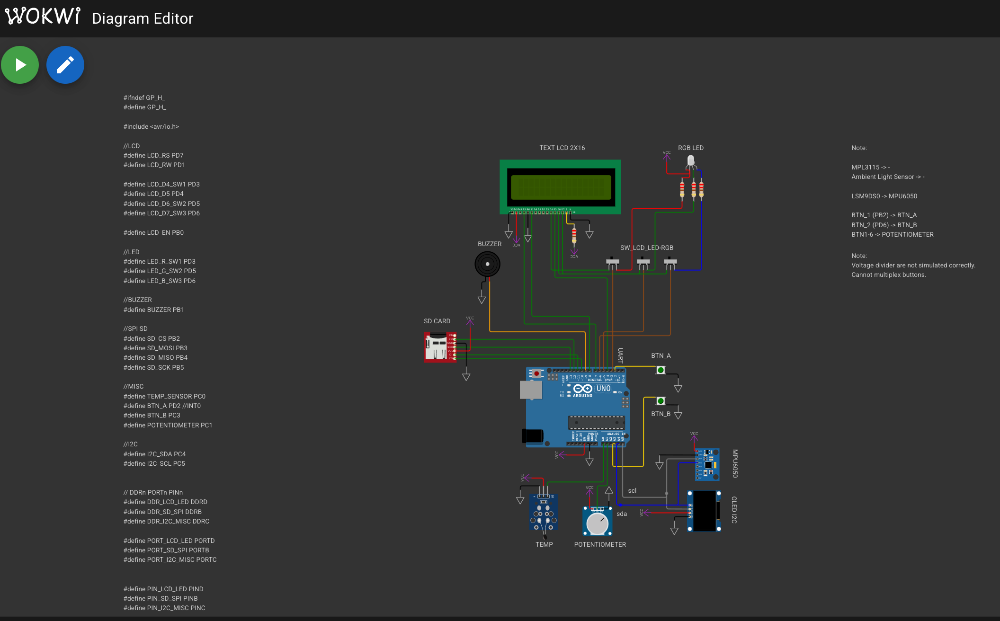

# Homework_template_2025

## Prerequisites
- [VSCode](https://code.visualstudio.com/) 
- [Platformio VsCode Extention](https://marketplace.visualstudio.com/items?itemName=platformio.platformio-ide)
- [Wokwi Extention](https://marketplace.visualstudio.com/items?itemName=wokwi.wokwi-vscode)

## Downloading and opening the project
- Clone this repository:
```git clone (https://github.com/UPB-FILS-AM-FR/Homework_template_2025.git)```
- Open with the project with platformio (click on the plaformio logo)


## Project structure
- `/include` : contains header files
- `/src` : c source files
- `diagram.json`: hardware schematic
- `platformio.ini`: platformio configuration file
- `wokwi.toml`: wokwi configuration file

## How to Build and Run

1. Select the lab homework you need from the [`/include/labs_en.h`](./include/labs_en.h) file. 
   Example for LAB3 - uncomment line with  `#define LAB3`. This will enable the the functions defined for LAB3 without conflicting with methods defined in other labs.
```c
// #define LAB0
// #define LAB1
// #define LAB2
 #define LAB3
// #define LAB4
// #define LAB5
// #define LAB6
```
**NOTE: The entrypoint for the project is in [`/src/main.c`](./src/main.c) file.**

2. From now on, you only need to modify the files in the [`src`](./src). Each lab homework has its own file called "lab*n*.c" along with their other lib files. (Example LAB3 has lab3.c and adc.c files that need to be modified). For each lab you need to modify the `setup_labn` and `loop_labn` functions. These functions will be called the the [`/src/main.c`](./src/main.c). 
- `setup_labn` will be called first in `main()` outside of the infinite loop
- `loop_labn` will be called in the `main()` infinite loop (`for(;;)`). So you don't need to create an infinite loop inside the `loop_labn` function.
3. Build the project. Either use the `CTRL + ALT + B` shortcut or click `build` in the platformio menu.
4. Run the program on the Wokwi simulator : 
- If the Wokwi extension is installed, you should be able to click on the [diagram.json](diagram.json) file and see the board schematic.

- Click on the green play button in the left corner. The simulation should start.

## Upload the homework

  - Compress as .zip
  - Upload the moodle :)